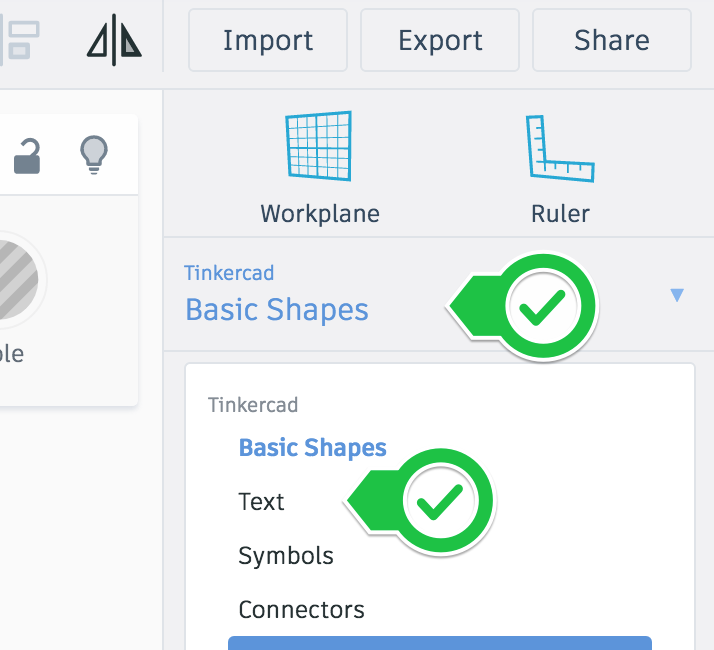

# In-Workshop Hands-On Activities

1. When thinking about & creating activities for an active-learning workshop, there are few guidelines to keep in mind that can help to ensure that your activities are as engaging & as relevant as possible:
- **Active**: Learning is not a spectator sport! Get participants engaged in skill development as quickly as possible and for as much time as possible. Lecture for only as long as absolutely necessary to get the hands-on work started.
- **Contextual**: Just-in-time learning to help participants with immediate problems or learning needs, not just-in-case learning (unless that is what the learner wants).
- **Choice**: Students should be given as much choice as possible during the workshop, especially, if possible with what they create with the new skills they are learning. 
- **Differentiated**: Allow participants to work at their own pace, and to customize the workshop with differentiated scaffolding to accommodate the various skill level that they bring with them.
- **Connect to Prior Knowledge**: Connect new skills in the workshop to prior participant knowledge. This is more difficult to do in a one-off workshop, but asking students what discipline they work in and what they hope to get out of the workshop during introductions at the beginning can help.

2. Create an active-learning in-class activity title & steps:
- Refer back to the workshop title and list of learning outcomes you created in the **previous activity** and try to think of an activity that will that can help meet one or more of the learning outcomes, while ideally also following the active-learning guidelines: active, contextual, provide choice, be differentiated, and connect to prior knowledge. It’s not always possible to create an activity that can follow all of those guidelines but do your best.
- For example, here is an active in-class activity title for an introduction to 3D design workshop: Design with Tinkercad Keychain In-Class Activity.
- **On the Instructor Outline Template form, please add the title of your activity.**

**In-Class Activity Title**: ______________________________________________________

- **Next start to outline the major steps that a participant will need to in order to successfully complete your activity.** For example, below are the major steps in bullet form for participants to follow for designing a [3D keychain in-class activity](http://bit.ly/2ZDgT6M){:target="_blank"}. 
  - Step 1: If you haven’t already, please go to the TinkerCad website and create an account for yourself: [http://tinkercad.com](http://tinkercad.com){:target="_blank"}. If you find yourself in a tutorial, click on the Tinkercad logo in the top left of the screen to exit to the home page. (active, differenciated)
  -  Step 2: Click “Create new design”. If the TinkerCad tutorial pane is up on the right-hand side, you will need to get out of it before proceeding. Click on the TinkerCad logo at the top to bring you back to your main page. From there you should see the “Create new design” button. (active, contextual, differentiated)
  - Step 3: On the right side of the TinkerCad click on “Basic Shapes” and then select the “Text and Numbers” option. This will display a list of 3D letters that you can scroll down through to find the whole alphabet, plus numbers 1 through 9. (active, contextual, choice, differentiated)
  - Step 4: Drag and drop all the letters from either your name onto the workplane. (active, contextual, choice, differentiated)
  - Step 5: Select all the letters and then click on the “Align Button” (active, contextual, differentiated, prior knowledge)
  - Step 6: Then click on the “handle on the bottom left of the text to align the text along the bottom. (active, contextual, differentiated, prior knowledge)

See this handout for the rest of the in-class activity instructions:  http://bit.ly/2ZDgT6M 
Flesh out each high-level step you create with sub-steps so that someone with little to no experience can complete the activity.
In-Class Activity Steps:
1. _______________________________________________________
2. _______________________________________________________
3. _______________________________________________________
4. _______________________________________________________
5. _______________________________________________________
6. _______________________________________________________
7. _______________________________________________________
8. _______________________________________________________

Where appropriate, insert graphics where visualizations can help participants better understand what they need to do better than text alone. Creative Commons licensed images can be copied and pasted into your Google Doc, and then cited at the end of the document.
Review your in-class activity to make sure that as much as possible the activity is: 
Active, Contextual, Student Choice, Differentiated, and Connected to Prior Knowledge.
Multiple activities often need to be created to cover all of the learning outcomes for the workshop and can help you differentiate for different skill levels and different participant learning goals. 
For example an introduction to Excel workshop took five separate activities to cover all of the learning outcomes, however, participants could choose to complete only the activities that were relevant to them.
Some participants had some experience with Excel, so they could skip ahead to the more advanced activities. For others, creating a Pivot table was an important skill to acquire, while most simply wanted to learn how to use basic functions, and create charts and tables from the results. 
Using multiple activities with handouts gives participants choice and the ability to work at their own pace, while having an instructor present to answer questions. Sometimes this form of instruction, when combined with pre-workshop videos or readings, is called flipped learning.

