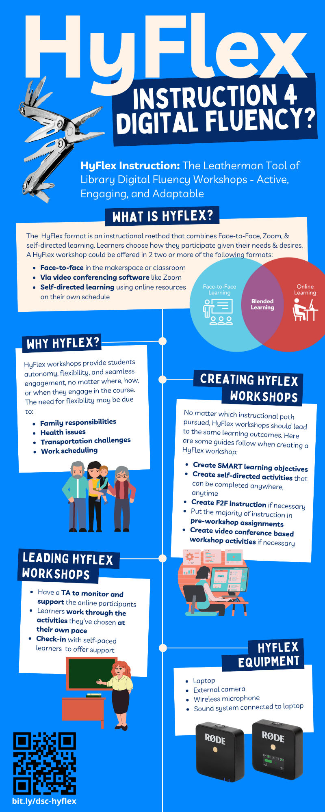

## {:target="_blank"}Pre-Workshop Videos & Activities
This workshop is primarily hands-on that will help you create the outline and some content for a Hyflex, Active Learning workshop. To participate fully please do the following **before the workshop**:

- **Before you arrive at the workshop**, please think of a new workshop tool or topic that might make an interesting workshop for the DSC (or for your organization if you are not part of the DSC). For example, I am interested in the Voyant Data Vistualization toolset and think it would be a good workshop topic. During the face-to-face workshop time I would use the Voyant toolset topic to create a workshop outline, and list of potential activities. 
- Review this [DSC Hyflex Infographic](/images/HyFlex-infographic.png){:target="_blank"} to get a sense for what HyFlex is in the context of library based digital fluency workshops (click the blue infographic to enlarge).
- [HyFlex - Learn from Anywhere!](https://www.youtube.com/watch?v=9OmqjtcOnI4){:target="_blank"} (1 min) 
<iframe width="560" height="315" src="https://www.youtube.com/embed/9OmqjtcOnI4" title="YouTube video player" frameborder="0" allow="accelerometer; autoplay; clipboard-write; encrypted-media; gyroscope; picture-in-picture" allowfullscreen></iframe>
- [Flipping the Classroom](https://www.youtube.com/watch?v=BfsLbGgUMDU){:target="_blank"} (2 min) 
<iframe width="560" height="315" src="https://www.youtube.com/embed/BfsLbGgUMDU" title="YouTube video player" frameborder="0" allow="accelerometer; autoplay; clipboard-write; encrypted-media; gyroscope; picture-in-picture" allowfullscreen></iframe>
- [Is Flipping for Everyone?](https://www.youtube.com/watch?v=FAWidtL7pKE) (3 min) 
<iframe width="560" height="315" src="https://www.youtube.com/embed/FAWidtL7pKE" title="YouTube video player" frameborder="0" allow="accelerometer; autoplay; clipboard-write; encrypted-media; gyroscope; picture-in-picture" allowfullscreen></iframe>
- [DSC Flipped Workshop Overview](https://www.youtube.com/watch?v=rXfTHVG_jmE){:target="_blank"} (6 min) 
<iframe width="560" height="315" src="https://www.youtube.com/embed/rXfTHVG_jmE" title="YouTube video player" frameborder="0" allow="accelerometer; autoplay; clipboard-write; encrypted-media; gyroscope; picture-in-picture" allowfullscreen></iframe>
- [Flipped Classroom Drawbacks](https://youtu.be/hXdbRatrX64?t=487){:target="_blank"} (2 min) NOTE: Please skip ahead to the 8 minute mark in the embedded video below. 
<iframe width="560" height="315" src="https://www.youtube.com/embed/hXdbRatrX64?t=487" title="YouTube video player" frameborder="0" allow="accelerometer; autoplay; clipboard-write; encrypted-media; gyroscope; picture-in-picture" allowfullscreen></iframe>
- [Learning Outcomes](https://www.youtube.com/watch?v=eXxTpDg1thI){:target="_blank"} (5 min) 
<iframe width="560" height="315" src="https://www.youtube.com/embed/eXxTpDg1thI" title="YouTube video player" frameborder="0" allow="accelerometer; autoplay; clipboard-write; encrypted-media; gyroscope; picture-in-picture" allowfullscreen></iframe>
- [Differentiated Learning](https://www.youtube.com/watch?v=h7-D3gi2lL8){:target="_blank"} (4 min) 
<iframe width="560" height="315" src="https://www.youtube.com/embed/h7-D3gi2lL8" title="YouTube video player" frameborder="0" allow="accelerometer; autoplay; clipboard-write; encrypted-media; gyroscope; picture-in-picture" allowfullscreen></iframe>
- [Exact Instructions Challenge ;-)](https://www.youtube.com/watch?v=cDA3_5982h8){:target="_blank"} (6 min) 
<iframe width="560" height="315" src="https://www.youtube.com/embed/cDA3_5982h8" title="YouTube video player" frameborder="0" allow="accelerometer; autoplay; clipboard-write; encrypted-media; gyroscope; picture-in-picture" allowfullscreen></iframe>
- OPTIONAL: [Resize Handouts for Your Laptop Screen](https://youtu.be/Igk5hZUfzN0){:target="_blank"} (2 min) 
<iframe width="560" height="315" src="https://www.youtube.com/embed/Igk5hZUfzN0" title="YouTube video player" frameborder="0" allow="accelerometer; autoplay; clipboard-write; encrypted-media; gyroscope; picture-in-picture" allowfullscreen></iframe>

[NEXT STEP: Introduction to Hands-On Activities](activities-intro.html){: .btn .btn-blue }
