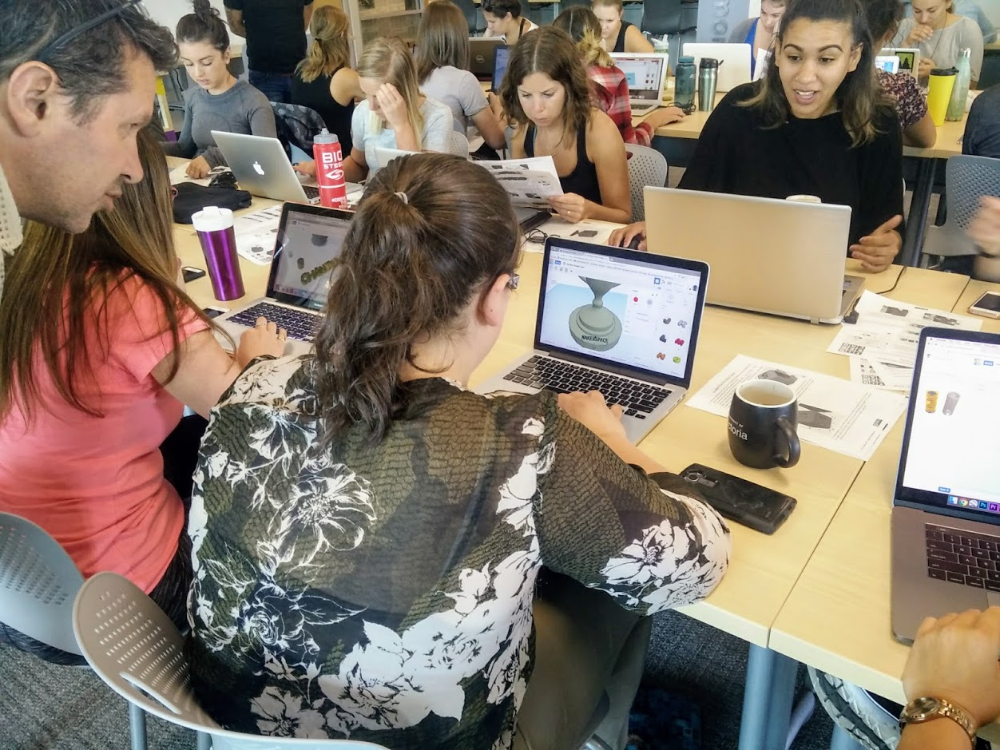

# Workshop Summary

### Learning Outcomes:
1. Create SMART learning outcomes for each of the things you want participants in your workshop to be able to do by the end of the workshop. Each learning outcome should be: 
- **Specific**: Exactly what is to be learned - who, what, where, why?
- **Measurable**: How will it be determined that the specific learning outcome has been met?
- **Attainable**: Ideally challenging learning outcomes within the ability of participants to achieve. Not out of reach but not too easy.
- **Relevant**: How does the learning outcomes relate to the needs and desires of the workshop participants?
- **Time-based**: When will the learning outcome be successfully completed? During or at the end of the workshop? At a future workshop or future date?
2. Here are examples of two SMART learning outcomes: 
- “By the end of this workshop participants will be able to add new shapes and text to the TinkerCad workspace in order to create a compound object.” 
- “By the end of this workshop participants will be able to describe the copyright and sharing issues around 3D design and printing.”

### Creating Activities:
3. Creating hands-on activities guiding principles:
- **Active**: Ideally get participants actively engaged in skill development as soon as possible in the workshop, and for as much time as possible during face-to-face time. Lecture for only as long as absolutely necessary.
- **Contextual**: The workshop should teach skills to participants that will help them either solve a problem that they currently have, or help them make progress on a class assignment. Our goal should be Just-in-time learning, not Just-in-case learning.
- **Choice**: Students should have as much choice as possible during the workshop, whether that be a choice of in-class activities, or to modify the activity to help solve a specific problem that they would like to solve. 
- **Differentiated**: Allow participants to work at their own pace, and to customize the workshop activities in order to focus on what is most relevant to the participant.
- **Connect to Prior Knowledge**: Where ever possible try to connect the skills and information in the workshop to prior knowledge. This will help participants recall new information.
- **Cover appropriate learning outcomes**: As you create the in-class activities, and the pre-class work, make sure that all of the learning outcomes you identified are appropriately covered.

### Pre-Class Videos & Readings:
4. You can create your own pre-workshop videos, but you may be able to find excellent resources on YouTube shared by other educators. 
5. The same goes with readings. You can create your own, but you may also be able to find many high-quality open educational resources that you can link to and cite.

### Trial Run:
6. Have someone who is not familiar with the workshop topic work through the pre-class workshop materials and in-class activities to make sure that they flow together nicely and that there are no obvious errors.

[NEXT STEP: Teaching Tips](teaching-tips.html){: .btn .btn-blue }
