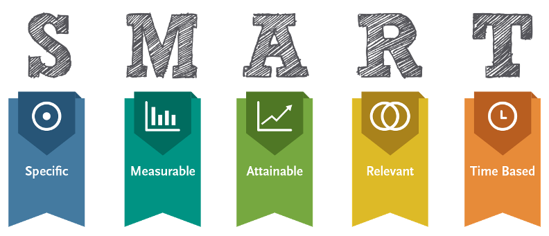

# Choosing a Topic & Creating Learning Outcomes

1. We have provided a workshop template for you to use, to help you organize your workshop, and you can either use a printed copy of the template provided by the workshop instructor or open the template below and make a copy for yourself to use as you create your own workshop: 
- Open Instructor outline template (a Google Doc): http://bit.ly/2SKcBf6 
- **File** -> **Make a Copy…**   Give your workshop an appropriate name. You may want to put this handout and the

2. Select your workshop topic for today:
- Select or create a topic for an introductory workshop that you would like to create. The topic should be something that you have some interest or expertise in, as well as the tools and classroom space to effectively teach. You can always change your topic, and you don't need to turn this into a real workshop, so don't worry about having a high quality topic for the workshop. The point is to have a topic that you can practice turing into a high quality workshop outline.
- Some example introductory workshop topics are: “Introduction to 3D Design & Printing,’” “Introduction to Version Control with GitHub,” “Introduction to - Programmable Electronics with Arduino,” or “Introduction to Augmented Reality with HP Reveal.”
- **Make the topic you just chose the title of your workshop template.** Please take a few minutes and decide what your workshop topic will be for the workshop, and it down. 

3. As you create learning outcomes for your topic, make sure you keep your target audience in mind:
- Who is your audience? What is their age and education level? Do they have experience with the topic you chose, or something closely related?
- What do you think they would like to get out of the workshop collectively and as individuals? Don’t be afraid to ask your colleagues, and prospective students what they would like to get out of the workshop. Occasionally you may find that the specific topic you chose is not as popular as you thought it was, so you may need to tweak or abandon the topic.
- The Curse of Expertise (Fisher & Keil, 2016): 
  - If you have significant experience or expertise in the area of the workshop, it is often difficult to remember what things or skills that you don’t need to explain in detail and which you’ll have to elaborate on. 
  - To guard against “the curse of expertise,” beta-test your workshop with a trusted novice so that you can get accurate feedback on what areas and words that need more explanation, and which areas you may have elaborated on too much.

4. Create SMART Learning Outcomes - Begin with the end in mind:
- Learning outcomes should each be SMART: Specific, Measurable, Attainable, Relevant, and Time-based (Chatterjee & Corral, 2017).
  - **Specific**: Exactly what is to be learned - who, what, where, why?
  - **Measurable**: How will it be determined that the specific learning outcome has been met?
  - **Attainable**: Ideally challenging learning outcomes within the ability of participants to achieve. Not out of reach but not too easy.
  - **Relevant**: How does the learning outcomes relate to the needs and desires of the workshop participants?
  - **Time-based**: When will the learning outcome be successfully completed? During or at the end of the workshop? At a future workshop or future date?
- Here are two examples of SMART learning outcomes:
  - “By the end of this workshop participants will be able to add new shapes and text to the TinkerCad workspace in order to create the compound object(s) they desire.” 

  - “By the end of this workshop participants will have created an Excel scatter plot chart and trend line using their own data (or sample data), and shared it with the instructor.”
- **Create two or more SMART learning outcomes** in the instructor outline in the **Learning outcomes** section - things you want each participant to leave your workshop knowing how to do. Current DSC workshops have as few as four learning outcomes and as many as nine.

**Learning outcomes:**
A. __________________________________ 
B. __________________________________ 
C. __________________________________ 

- After creating the learning outcomes for your workshop, you need to decide if the learning outcomes can be achieved within the parameters of a typical DSC workshop. Workshop parameters typically include:
  - How much time do you have to run the workshop? 60 minute, 90 minutes, all day? Estimate the length of time it will take to achieve each of the learning outcomes. Can you cover them all at least minimally in the time available?
  - If specific tools or equipment are essential to the workshop, how many participants can reasonably use the equipment/tools available and still achieve the learning outcomes?
  - How many instructors and/or teaching assistants are available to teach the workshop?
  - How many people can the room, lab, or makerspace accommodate?
- Keeping in mind the parameters of the workshop you have just identified, **do you need to reduce the number of learning outcomes?** Some options to consider if you need to eliminate some learning outcomes:
  - Split up the workshop into more than one session.
  - Determine what learning outcomes can be moved into an intermediate workshop.
  - Drop one or more learning outcomes.

Good job! Time to move on to creating hands-on activities for your workshop.

[NEXT STEP: In-Workshop Hands-On Activities](hands-on-activities.html){: .btn .btn-blue }
